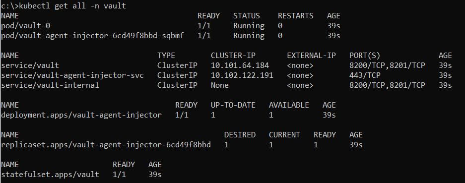
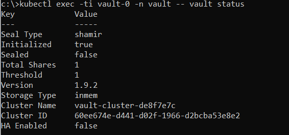
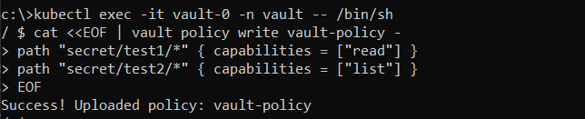
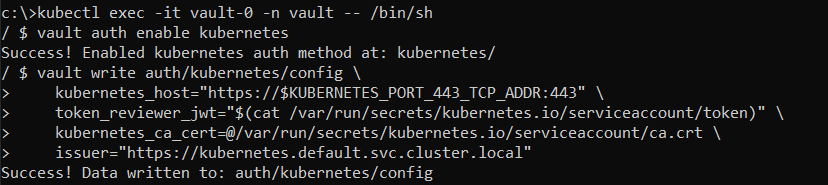
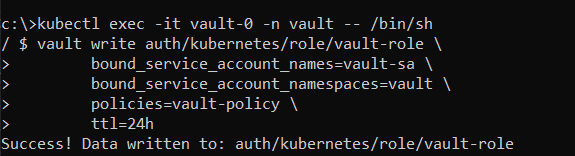
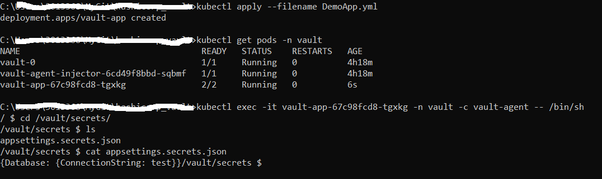

- [About Vault](#about-vault)
  - [Security](#security)
    - [Sealed/Unsealed state](#sealedunsealed-state)
  - [Highly available](#highly-available)
- [Secrets engines](#secrets-engines)
- [Auth Method](#auth-method)
  - [Kubernetes](#kubernetes)
- [Run Vault on Kubernetes](#run-vault-on-kubernetes)
  - [Demo](#demo)
    - [Prerequisite](#prerequisite)
    - [Installation](#installation)
- [Summary](#summary)
  - [Pros](#pros)
  - [Cons](#cons)
- [Useful links](#useful-links)

# About Vault

## Security

There is a clear separation of components that are inside or outside of the security barrier. Only the storage backend and the HTTP API are outside, all other components are inside the barrier.

The storage backend is untrusted and is used to durably store encrypted data. When the Vault server is started, it must be provided with a storage backend so that data is available across restarts. 

The HTTP API similarly must be started by the Vault server on start so that clients can interact with it.

### Sealed/Unsealed state

Once started, the Vault is in a sealed state. In this state, Vault is configured to know where and how to access the physical storage, but doesn't know how to decrypt any of it. Before any operation can be performed on the Vault it must be unsealed. This is done by providing the unseal keys. When the Vault is initialized it generates an encryption key which is used to protect all the data. That key is protected by a master key.

The data stored by Vault is encrypted. Vault needs the encryption key in order to decrypt the data. The encryption key is also stored with the data (in the keyring), but encrypted with another encryption key known as the master key.
Unsealing is the process of getting access to this master key. The master key is stored alongside all other Vault data, but is encrypted by yet another mechanism: the unseal key.

## Highly available

When running in HA mode, Vault servers have two additional states they can be in: standby and active. For multiple Vault servers sharing a storage backend, only a single instance will be active at any time while all other instances are hot standbys.

The active server operates in a standard fashion and processes all requests. The standby servers do not process requests, and instead redirect to the active Vault. Meanwhile, if the active server is sealed, fails, or loses network connectivity then one of the standbys will take over and become the active instance.

It is important to note that only unsealed servers act as a standby. If a server is still in the sealed state, then it cannot act as a standby as it would be unable to serve any requests should the active server fail.

# Secrets engines

Secrets engines are components which store, generate, or encrypt data. Some secrets engines simply store and read data - like encrypted Redis/Memcached. Other secrets engines connect to other services and generate dynamic credentials on demand. Other secrets engines provide encryption as a service, totp generation, certificates, and much more.

For instance, it could be just regular Key-Value pair.

The list of the supported secrets engines could be found here https://www.vaultproject.io/docs/secrets

# Auth Method

Auth methods are the components in Vault that perform authentication and are responsible for assigning identity and a set of policies to a user. In all cases, Vault will enforce authentication as part of the request processing. In most cases, Vault will delegate the authentication administration and decision to the relevant configured external auth method (e.g., Amazon Web Services, GitHub, Google Cloud Platform, Kubernetes, Microsoft Azure, Okta ...).

## Kubernetes

The kubernetes auth method can be used to authenticate with Vault using a Kubernetes Service Account Token. This method of authentication makes it easy to introduce a Vault token into a Kubernetes Pod.

More details on how to configure kubernetes auth method could be found here https://www.vaultproject.io/docs/auth/kubernetes

# Run Vault on Kubernetes

Vault can be deployed into Kubernetes using the official HashiCorp Vault Helm chart. Helm chart repo could be found here https://github.com/hashicorp/vault-helm. It is possible to deploy Vault in various configurations, more details on chart values could be found here https://www.vaultproject.io/docs/platform/k8s/helm/configuration

1. Dev: a single in-memory Vault server for testing Vault
1. Standalone (default): a single Vault server persisting to a volume using the file storage backend
1. High-Availability (HA): a cluster of Vault servers that use an HA storage backend such as Consul (default)
1. External: a Vault Agent Injector server that depends on an external Vault server

More details on how to install vault in different configurations could be found here https://www.vaultproject.io/docs/platform/k8s/helm/run.

## Demo

### Prerequisite

1. Docker Desktop with Kubenrnetes v1.22.4
1. Helm v3.8.0

### Installation

1. Create Kubernetes namespace **vault**:
   
   `kubectl create namespace vault`

1. Install Helm chart hashicorp/vault v0.19.0 with DEV configuration, unseal for DEV configuration is not needed:
   
   `helm repo add hashicorp https://helm.releases.hashicorp.com`

   `helm install vault hashicorp/vault --set "server.dev.enabled=true" --namespace vault --version 0.19.0`
   

   `kubectl exec -ti vault-0 -n vault -- vault status`
   
   

   1. In order to make unseal run next commands:
   
      `kubectl exec -ti vault-0 -- vault operator init` - returns all unseal keys

      `kubectl exec -ti vault-0 -- vault operator unseal` - must be run for each unseal key

      Another way to unseal is via UI (https://learn.hashicorp.com/tutorials/vault/getting-started-ui?in=vault/getting-started):

      `kubectl port-forward vault-0 8200:8200`

1. Configure Read-Only policy

   `kubectl exec -it vault-0 -n vault -- /bin/sh` - jump into pod
   
   `cat <<EOF | vault policy write vault-policy -`
   `path "secret/data/test1/*" { capabilities = ["read"] }`
   `path "secret/data/test2/*" { capabilities = ["list"] }`
   `EOF`

   

1. Create service account (see ClusterRoleBinding.yml). Service account provides an identity for processes that run in a Pod so that the processes can contact the API server.
   
   `kubectl create serviceaccount vault-sa -n vault`

2. Configure Kubernetes auth method
   
   `kubectl exec -it vault-0 -n vault -- /bin/sh` - jump into pod

   `vault auth enable kubernetes` - run the command inside pod

   `vault write auth/kubernetes/config \`
      `kubernetes_host="https://$KUBERNETES_PORT_443_TCP_ADDR:443" \`
      `token_reviewer_jwt="$(cat /var/run/secrets/kubernetes.io/serviceaccount/token)" \`
      `kubernetes_ca_cert=@/var/run/secrets/kubernetes.io/serviceaccount/ca.crt \`
      `issuer="https://kubernetes.default.svc.cluster.local"` - configure the Kubernetes authentication method

      The token_reviewer_jwt and kubernetes_ca_cert are mounted to the container by Kubernetes when it is created. The environment variable KUBERNETES_PORT_443_TCP_ADDR is defined and references the internal network address of the Kubernetes host.

   

3. Create a role that maps the Kubernetes Service Account to Vault policy

   `kubectl exec -it vault-0 -n vault -- /bin/sh` - jump into pod
   
   `vault write auth/kubernetes/role/vault-role \`
      `bound_service_account_names=vault-sa \`
      `bound_service_account_namespaces=vault \`
      `policies=vault-policy \`
      `ttl=24h`
   
   

4. Add secret (more details could be found here https://learn.hashicorp.com/collections/vault/secrets-management)
   
   `vault secrets enable -path=secret kv-v2`

   `vault kv put secret/test1/config config="{Database: {ConnectionString: test1}}" ttl=1m`

5. Deploy a test app (see DemoApp.yml)
   
   `kubectl apply --filename DemoApp.yml`

   DemoApp.yml contains the necessary anotations to read the corresponding secret and store it in the appsettings.secrets.json file. appsettings.secrets.json could be merged afterwards with other appsettings. 

   

# Summary

## Pros

1. The Vault is a centralized place to store secrets, as a result it is easy to update/add/delete secrets.
1. The Vault has a good support from a lot of Secret Engines, for instance AWS, Azure.
1. It's easy to stick a less privileged approach by restricting access with vault policies.

## Cons

1. It is obvious, that additional configuration in Kubernetes is needed to support the extraction of secrets from the Vault.

# Useful links

1. https://www.vaultproject.io/docs/what-is-vault
1. https://www.vaultproject.io/docs
1. https://learn.hashicorp.com/tutorials/vault/kubernetes-sidecar 

1. https://mermaid-js.github.io/mermaid/#/./n00b-syntaxReference
1. https://www.markdownguide.org/basic-syntax/
1. https://mermaid-js.github.io/mermaid-live-editor